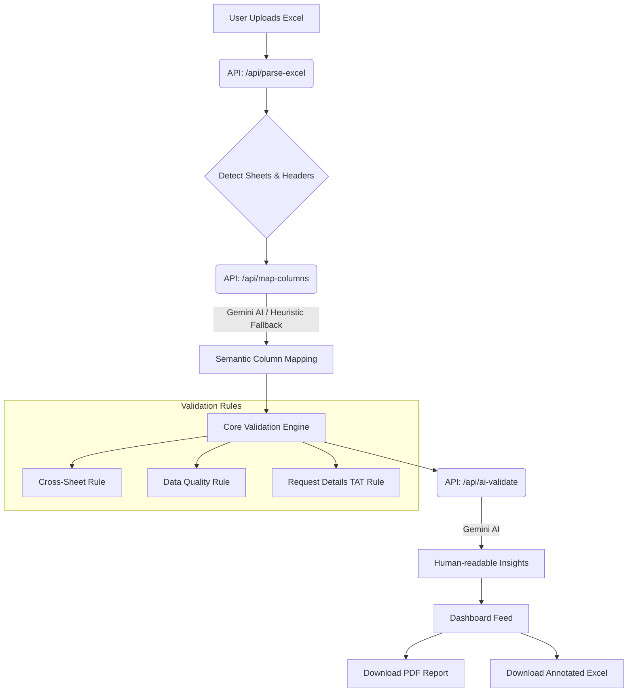

# ExcelAudit - AI-Powered Hospital Data Validation

ExcelAudit is an intelligent Next.js application designed to parse, validate, and analyze hospital operational Excel data (specifically Porter Management reports). It flags inconsistencies across sheets, applies strict TAT (Turn-Around Time) arithmetic validation, and leverages AI (Google Gemini) to provide natural-language insights and human-readable remediation reports.

## 🚀 Key Features

- **Heuristic & AI Column Mapping:** Intelligently maps varying hospital Excel headers to standard concepts (Waitlist, TAT, Requests) using Gemini or a robust heuristic fallback.
- **Cross-Sheet Count Consistency:** Ensures request totals match across Daily Summaries, Location Summaries, and Pool Summaries.
- **TAT Arithmetic Validation:** Validates that time components (`wait_time + create_to_accept + accept_to_arrive + arrive_to_complete`) sum up precisely to the `total_duration`.
- **Dynamic Annotated Excel Download:** Generates a downloadable `.xlsx` copy of the original data with color-coded error rows and a dedicated "Validation Notes" column explaining the exact failures.
- **PDF Report Generation:** Generates comprehensive PDF reports summarizing the data health, top issues, and AI recommendations.

## 🏗️ Architecture Flow



## 📁 File Structure

```text
├── app/
│   ├── api/                 # Next.js Serverless API routes
│   │   ├── ai-validate/     # Gemini issue enrichment 
│   │   ├── download-annotated/ # Annotated ExcelJS generation
│   │   ├── generate-report/ # PDF generation backend
│   │   ├── map-columns/     # AI column identification
│   │   └── parse-excel/     # Initial XLSX parsing
│   ├── validate/            # Dashboard page
│   ├── globals.css          # Tailwind and global styles
│   ├── layout.tsx           # Main application layout
│   └── page.tsx             # Upload landing page
├── components/              
│   ├── dashboard/           # UI for validation feed, charts, and summary bar
│   ├── report/              # PDF Download Modal & configuration
│   ├── ui/                  # Reusable Shadcn UI components
│   └── ValidationProvider.tsx # React Context holding workbook & original file state
├── lib/
│   ├── ai/                  # AI mapping & enrichment logic
│   ├── report/              # Annotated Excel generation (ExcelJS) and PDF logic
│   ├── utils/               # Helper utilities (time parsing, formatting)
│   └── validator/           # Core Validation Engine
│       ├── rules/           # Individual rules (cross-sheet, request-details, data-quality)
│       └── types.ts         # Centralized TypeScript definitions
└── public/                  # Static assets
```

## 🛠️ Getting Started

### 1. Installation
Clone the repository and install dependencies using `pnpm`:
```bash
pnpm install
```

### 2. Environment Variables
Create a `.env.local` file in the root directory and add your Google Gemini API key:
```env
GEMINI_API_KEY="your_google_gemini_api_key_here"
```

### 3. Run the Development Server
```bash
pnpm dev
```
Open [http://localhost:3000](http://localhost:3000) to upload your hospital data.

## 🛡️ Security & Performance Notes

- **In-memory Processing:** Uploaded files are parsed entirely in memory. The original file is stored safely in React State (via `File` object) to avoid server memory bloat, and is only sent back to the server as `FormData` when downloading the Annotated Excel.
- **Graceful Fallbacks:** If the Gemini API hits rate limits (429/503), the application seamlessly falls back to a Regex-based Heuristic column mapping and skips AI text enrichment without crashing.
- **ExcelJS over SheetJS:** Excel generation uses `exceljs` to support cell coloring (ARGB), custom font styling, and multiple sheets for the annotated output.

## 🧪 Testing

Playwright E2E tests cover the full upload and validation flow:
```bash
npx playwright test
```
